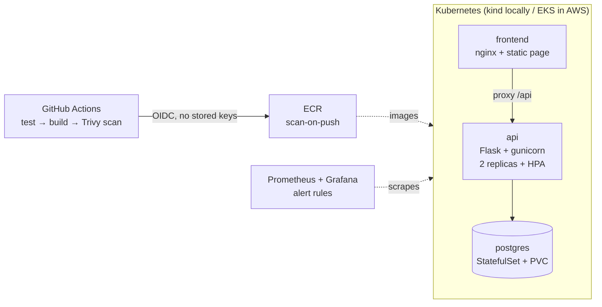

# k8s-devops-capstone

A containerized 3-tier application (nginx frontend → Flask API → Postgres) deployed to Kubernetes, with the full operational layer around it: Terraform-provisioned AWS EKS, GitHub Actions CI/CD with image scanning, and Prometheus/Grafana monitoring with alert rules.

The app itself is deliberately small — the project is the **infrastructure**: how the workload is built, shipped, secured, observed, and paid for.

> Companion project: [hardened-Cloud-Resume-Challenge](https://github.com/anoop-singh02/hardened-Cloud-Resume-Challenge) covers the serverless side of the same skill set (Lambda, DynamoDB, CloudFront, WAF).

## Architecture



- **Local**: `kind` cluster, images side-loaded, app at `http://localhost:8080`. Free, fast iteration.
- **AWS**: EKS + managed node group provisioned by Terraform, images from ECR, deployed by a manually-triggered workflow. Spun up for demos, destroyed after — the control plane alone costs ~$0.10/hour.

## Quickstart (local, free)

Requires Docker, [kind](https://kind.sigs.k8s.io/), kubectl.

```bash
make kind-up        # create the local cluster
make deploy-local   # build images, load into kind, kubectl apply
# open http://localhost:8080
make kind-down      # tear down
```

Run the API tests: `make test` (pytest, uses SQLite so no database setup needed).

## Deploying to AWS

1. **Provision** (needs an S3 state bucket + DynamoDB lock table — see `infrastructure/backend.tf` for the init flags):

   ```bash
   cd infrastructure
   terraform init -backend-config="bucket=..." -backend-config="key=k8s-devops-capstone/terraform.tfstate" \
                  -backend-config="region=..." -backend-config="dynamodb_table=..."
   terraform apply
   ```

2. **Wire up GitHub**: take the `github_deploy_role_arn` output and set it as the `AWS_DEPLOY_ROLE_ARN` repo secret; set `POSTGRES_PASSWORD` as a secret too.

3. **Deploy**: run the **Deploy to EKS** workflow (manual trigger, by design — this cluster is not meant to idle).

4. **Monitoring**: install kube-prometheus-stack with the values file in `monitoring/`, apply `monitoring/alert-rules.yaml` (instructions in the file headers).

5. **Tear down**: `terraform destroy`. Do not skip this.

## Design decisions, by Well-Architected pillar

**Security.** CI fails on HIGH/CRITICAL vulnerabilities (Trivy) before an image can ship, and ECR scans again on push — two independent gates. GitHub Actions authenticates to AWS via OIDC federation scoped to this repo's `main` branch; there are no long-lived AWS keys anywhere in the pipeline. The deploy IAM role can push to exactly two ECR repos and describe one cluster — nothing else. Containers run non-root with dropped capabilities, a read-only root filesystem (API), and `RuntimeDefault` seccomp. Database credentials are generated at deploy time from GitHub secrets; only `.example` files are committed. The demo VPC uses public subnets with no inbound security-group rules — a documented cost trade-off; production would move nodes to private subnets behind NAT and add External Secrets Operator + AWS Secrets Manager instead of generated secrets.

**Reliability.** The API runs 2+ replicas behind a Service, with distinct liveness (`/healthz`, no DB dependency — a slow database shouldn't restart pods) and readiness (`/readyz`, checks the DB — an unhealthy pod should leave the load-balancing pool) probes. Rollouts are gated by `kubectl rollout status` in the pipeline. Postgres is the honest weak point: a single-replica StatefulSet with a PVC is fine for a demo but has no failover or backups — the production answer is RDS Multi-AZ, traded away here for cost and self-containment.

**Performance efficiency.** Every container declares resource requests (so the scheduler can bin-pack) and memory limits (so a leak evicts one pod, not the node). The HPA scales the API 2→5 replicas at 70% CPU — in the prod overlay only, since kind lacks metrics-server. `t3.medium` nodes are the practical floor for EKS; smaller instances exhaust pod ENI slots before CPU.

**Cost optimization.** Day-to-day development runs on kind at exactly $0. The EKS stack exists only during demos: `terraform apply`, show it, `terraform destroy` — at ~$0.10/hr control plane + 2×t3.medium, a two-hour demo costs under a dollar; forgetting it for a month costs ~$135. ECR lifecycle policy caps stored images at 10. No NAT gateways (~$65/month saved) — the security section explains what that trades away.

**Operational excellence.** Everything is code: infrastructure (Terraform), workloads (kustomize base + overlays, so local and prod share one source of truth), pipelines (Actions), monitoring (Helm values + PrometheusRule in-repo). CI validates the Terraform and renders both overlays on every PR, so drift between environments is caught before merge. Alerts are defined for the two failure modes that matter most in a small cluster: zero available API replicas (page-worthy) and restart-looping pods (investigate).

## Possible extensions

- Ingress + AWS Load Balancer Controller instead of the nginx proxy hop
- External Secrets Operator + AWS Secrets Manager for secret material
- Argo CD for pull-based GitOps instead of push-from-CI
- RDS via Terraform, replacing the in-cluster Postgres

## Repository layout

```
app/            # api (Flask + tests + Dockerfile), frontend (nginx + static)
k8s/            # kustomize base + local (kind) and prod (EKS) overlays
kind/           # local cluster config
infrastructure/ # Terraform: VPC, EKS, ECR, GitHub OIDC deploy role
monitoring/     # kube-prometheus-stack values + alert rules
.github/        # CI (test/build/scan/validate) + manual EKS deploy
```
